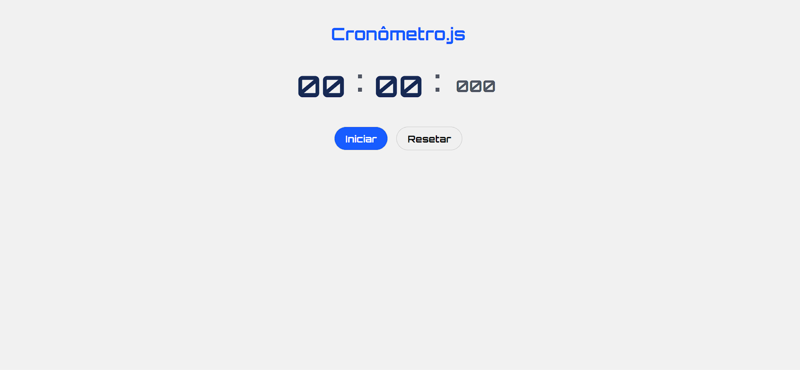

# Cronômetro

Um simples cronômetro implementado em JavaScript.

Este projeto consiste em um cronômetro com funcionalidades de iniciar, pausar, retomar e reiniciar.

## Visualização

## Funcionalidades

- Iniciar o cronômetro para contar o tempo em milissegundos.
- Pausar o cronômetro, pausando a contagem do tempo.
- Retomar o cronômetro a partir do ponto onde foi pausado.
- Reiniciar o cronômetro, zerando o tempo.

## Como Usar

1. Baixe os arquivos deste projeto ou clone o repositório.
2. Abra o arquivo `index.html` em um navegador da web.
3. O cronômetro será exibido na página.
4. Clique no botão "Iniciar" para iniciar o cronômetro.
5. Clique no botão "Pausar" para pausar o cronômetro.
6. Clique no botão "Continuar" para retomar o cronômetro após pausá-lo.
7. Clique no botão "Reiniciar" para zerar o cronômetro.

## Personalização

Você pode personalizar a aparência do cronômetro através do arquivo CSS `styles.css`. Altere as classes CSS para ajustar o estilo do cronômetro de acordo com suas preferências.

## Contribuindo

Contribuições são bem-vindas! Se você encontrar algum problema, tiver sugestões ou melhorias, sinta-se à vontade para abrir uma nova issue ou enviar um pull request.

## Licença

Este projeto está licenciado sob a Licença MIT. Consulte o arquivo `LICENSE` para obter mais informações.

